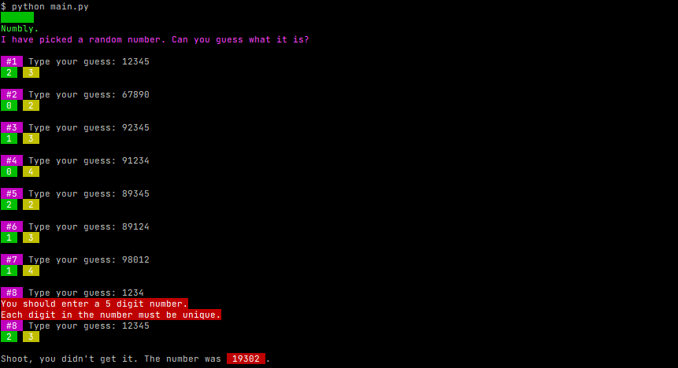

# Wordle CLI

> Abdi Adem | 2022

How about a number version of wordle, huh?. Made using [Typer](https://typer.tiangolo.com/).

***Hint: It is almost exactly the same as my CLI version Wordle, just for numbers.***

### Screenshots


To get started:

```sh
git clone https://github.com/AbdiA3/wordle-cli.git
cd wordle-cli
pip install typer # UNIX: pip3 install typer 
python main.py # UNIX: python3 main.py
```

If you want to see the rules you can add `--rules` flag.
```sh
python main.py --rules # UNIX: python3 main.py --rules
```

When installing Typer it will automatically install the following packages.
```sh
click
colorama
typer
```